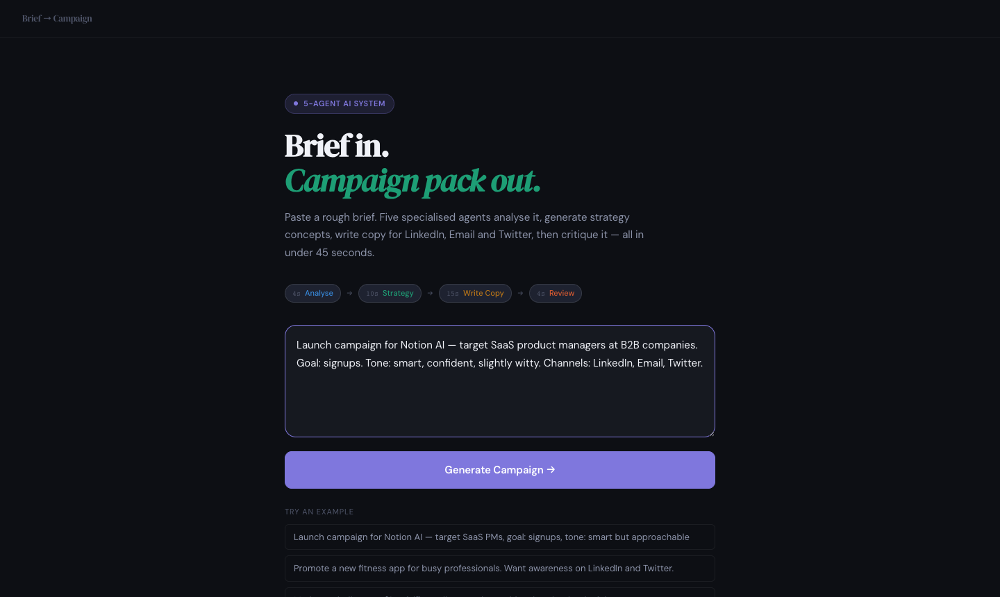
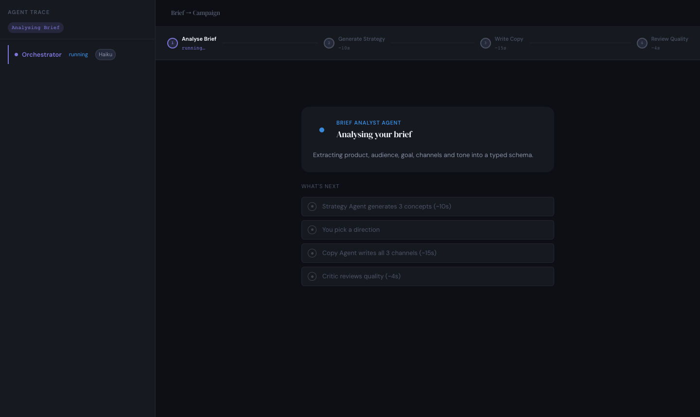
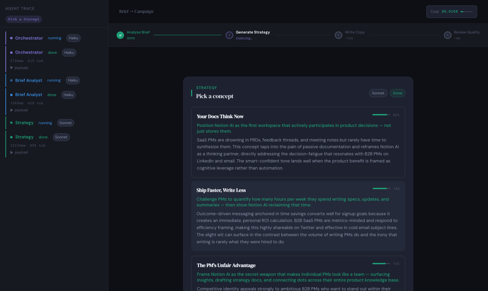
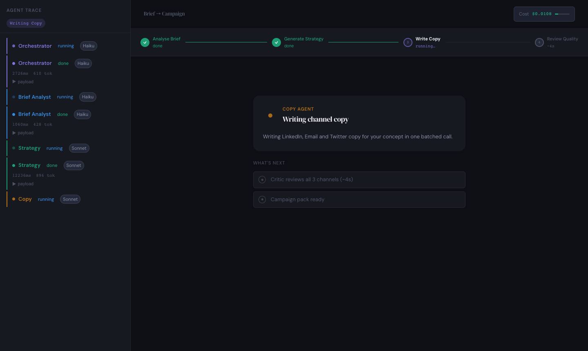
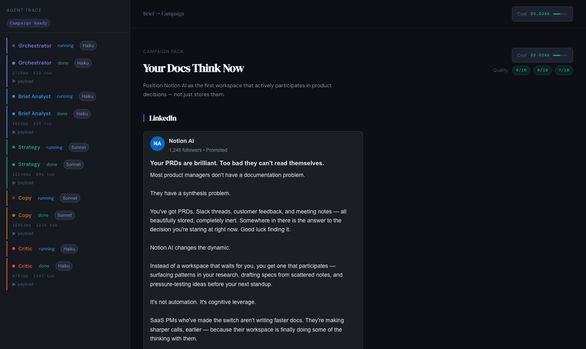
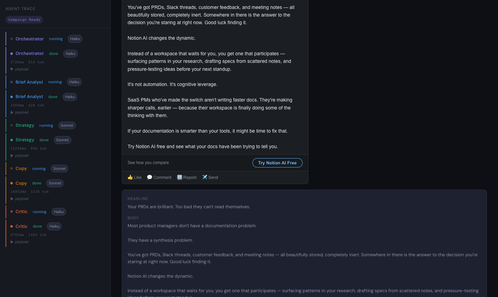

# Brief → Campaign — Multi-Agent Workflow

> Turn a vague marketing brief into a structured, channel-ready campaign pack using 5 specialised AI agents, a finite state machine, and two human-in-the-loop checkpoints.

---

## The Problem

Marketing teams start with a brief like:

> *"Launch something for our new AI feature. Target developers. Make it feel smart."*

That brief is too vague to act on — but too common to ignore. Someone has to extract the structure, generate strategy options, write copy for each channel, and check the quality. That process takes hours and multiple people.

This system does it in under 60 seconds, transparently, with every agent decision visible and auditable.

---

## How It Works

### 5 Agents, Single Responsibility Each

| Agent | Model | Role |
|---|---|---|
| **Orchestrator** | Haiku | Parses brief → produces ordered workflow plan. Never writes copy. |
| **Brief Analyst** | Haiku | Extracts structured schema: product, audience, goal, channels, tone. Flags gaps. |
| **Strategy** | Sonnet | Generates 3 distinct campaign concepts with confidence scores. |
| **Copy** | Sonnet | Writes headline + body + CTA for all 3 channels in one batched call. |
| **Critic** | Haiku | Scores copy 0–10 per channel vs brief fidelity. Triggers retry if any score < 7. |

Haiku handles structured extraction and evaluation (pattern matching). Sonnet handles creative reasoning. This keeps cost under **~$0.008 per campaign**.

### Finite State Machine

The workflow is modelled as an explicit FSM — no implicit control flow.

```
IDLE
  → EXTRACTING              (Brief Analyst running)
  → AWAITING_CLARIFICATION  (gaps found — user must answer)
  → STRATEGIZING            (Strategy Agent running)
  → AWAITING_CONCEPT_PICK   (user must pick a concept)
  → WRITING                 (Copy Agent running)
  → REVIEWING               (Critic Agent running)
  → RETRYING                (Copy Agent re-running with critique notes)
  → DONE
  → ERROR
```

Every transition is logged as a typed `AgentEvent` and shown live in the trace panel.

### Two Human-in-the-Loop Gates

1. **Clarification gate** — if the Brief Analyst finds missing fields (e.g. no audience, no goal), it surfaces max 2 targeted questions. The workflow is blocked until answered.
2. **Concept selection gate** — the Strategy Agent returns 3 concepts. The user must pick one before copy is written. Includes a "Regenerate" option with cost estimate shown.

### Critic → Retry Loop

After copy is written, the Critic scores each channel. Any channel scoring below 7/10 is flagged for revision. The Copy Agent retries with the critique notes as additional context. Max 2 retries — after that, the critique notes are surfaced to the user alongside the output.

---

## Workflow Screenshots

### 1. Brief Input

> The landing screen. Paste a rough brief in plain English — or pick one of the examples. The pipeline preview ("Analyse → Strategy → Write Copy → Review") sets expectations before a single token is spent.

---

### 2. Brief Filled In

> Once you start typing the CTA button activates. The agents will surface a clarification gate if anything critical is missing — you don't need a perfect brief.

---

### 3. Agents Running — Live Trace Panel

> Immediately after submit, the two-column layout appears. Left: the live agent trace panel — each event streams in as it fires, showing agent name, status badge, model used (Haiku vs Sonnet), latency in ms, and token count. Right: the progress stepper at the top shows exactly where you are in the pipeline with time estimates for upcoming steps. The running card shows which agent is active, what it's doing, and what comes next.

---

### 4. Concept Picker (Human Gate 1)

> The Strategy Agent returns 3 meaningfully different campaign angles, each with a confidence score (0–100%) reflecting how well it matches the stated goal. **The workflow is blocked until you pick one.** This is a deliberate human checkpoint — the selected concept becomes the creative brief for the Copy agent.

---

### 5. Copy Agent Writing

> The Copy agent writes LinkedIn, Email and Twitter copy in a **single batched API call** — not 3 separate calls. The progress stepper updates in real time. "What's next" shows the remaining steps so you always know the end is in sight.

---

### 6. Campaign Pack — Output

> The finished campaign pack. The concept name and hook are shown at the top, with quality scores per channel from the Critic agent (e.g. LinkedIn: 8/10, Email: 7/10, Twitter: 9/10). The cost counter in the top right shows the total spend for the full 5-agent run — typically $0.006–0.010.

---

### 7. Campaign Pack — Copy Sections

> Each channel section renders a live social preview card (LinkedIn mockup shown here) followed by the raw copy fields — headline, body, CTA. The copy is ready to use or adapt.

---

## Running Locally

### Prerequisites
- Node.js 18+
- An [Anthropic API key](https://console.anthropic.com/settings/keys)

### Setup

```sh
# 1. Install dependencies
npm install

# 2. Create your .env file
cp .env.example .env
# Edit .env and paste your ANTHROPIC_API_KEY

# 3. Start both servers (proxy + Vite) with one command
npm run dev
```

Open **http://localhost:5173** (or the port Vite picks if 5173 is in use).

### How the local setup works

`npm run dev` runs two processes via `concurrently`:
- **`node server.cjs`** — a plain Node HTTP proxy on port 3001 that forwards requests to the Anthropic API using your key from `.env`. This exists because browsers can't call the Anthropic API directly (no CORS + key exposure).
- **`vite`** — the React dev server, configured to proxy `/api/*` to `localhost:3001`.

---

## Project Structure

```
/
├── api/agent.js          ← Vercel serverless function (production)
├── server.cjs            ← Local dev proxy (port 3001)
├── src/
│   ├── agents/
│   │   ├── orchestrator.js
│   │   ├── analyst.js
│   │   ├── strategy.js
│   │   ├── copy.js
│   │   └── critic.js
│   ├── state/fsm.js      ← All FSM states + transition validation
│   ├── schemas/types.js  ← Typed schemas + cost calculation
│   └── components/
│       ├── TracePanel.jsx    ← Live observability panel
│       ├── CostCounter.jsx   ← Running cost with cap warning
│       ├── StepCard.jsx      ← Reusable workflow step card
│       └── CampaignPack.jsx  ← Final output
└── .env.example
```

---

## Typed Agent Contracts

All agent communication uses typed JSON schemas — no free-form strings between agents.

```typescript
interface BriefSchema {
  product: string | null;
  audience: string | null;
  goal: "downloads" | "signups" | "awareness" | null;
  channels: string[];
  tone: string | null;
  gaps: string[];           // missing fields — trigger clarification gate
}

interface Concept {
  name: string;
  hook: string;
  rationale: string;
  confidence: number;       // 0.0 – 1.0
}

interface CopyBundle {
  linkedin: { headline: string; body: string; cta: string };
  email:    { headline: string; body: string; cta: string };
  twitter:  { headline: string; body: string; cta: string };
}

interface CritiqueResult {
  scores: { linkedin: number; email: number; twitter: number };
  retry: string[];          // channels scoring < 7
  notes: string;
}
```

---

## Cost

| Agent | Model | Typical cost |
|---|---|---|
| Orchestrator + Analyst | Haiku | ~$0.0002 |
| Strategy | Sonnet | ~$0.0011 |
| Copy | Sonnet | ~$0.0042 |
| Critic | Haiku | ~$0.0009 |
| **Total** | | **~$0.006–0.009** |

With up to 2 Critic-triggered retries: max ~$0.014. A $0.05 cap is enforced in the UI.

---

## Key Design Decisions

**Why Haiku for Orchestrator/Analyst/Critic?**
Routing, extraction, and evaluation are structured comparisons — they don't need Sonnet's reasoning depth. Sonnet is reserved for the two tasks that genuinely require creativity: ideating concepts and writing copy.

**Why batch all 3 channels in one Copy call?**
Three separate calls would triple the latency and input token cost (the system prompt + brief + concept would be sent three times). One call with all channels specified is ~40% cheaper.

**Why an explicit FSM?**
An implicit workflow (a chain of `await` calls) is invisible and hard to debug. The FSM makes every state transition a named, logged, validatable event — which is exactly what you need when something goes wrong at 2am.

**Why two human checkpoints?**
The clarification gate ensures the agents never hallucinate missing brief fields. The concept selection gate ensures a human owns the creative direction before tokens are spent on full copy. Both gates are non-bypassable by design.
