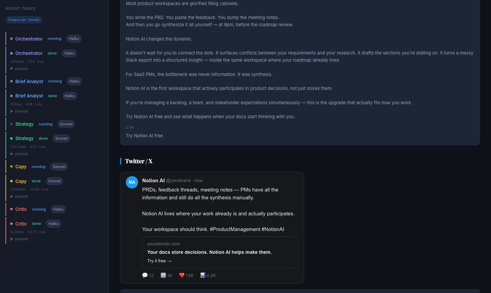
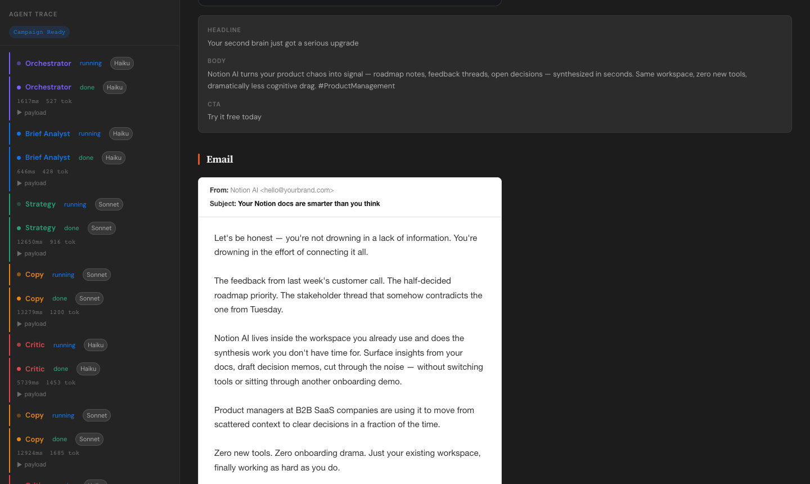

# Brief → Campaign — Multi-Agent Workflow

> Turn a vague marketing brief into a structured, channel-ready campaign pack using 5 specialised AI agents, a finite state machine, and two human-in-the-loop checkpoints.

---

## The Problem

Every marketer has the same wall. They know what they want to say. They just can't get it out fast enough — or well enough — to matter.

A product launches next week. The founder has the story in their head — the audience, the angle, the urgency. But turning that mental brief into a LinkedIn post, an email, and a tweet — each adapted for its platform, each on-brand, each strategically sound — takes hours they don't have. So they rush it, post something mediocre, and leave reach on the table. Every single week.

```
What exists in their head          →  3–5 hrs of manual work  →  What needs to exist
─────────────────────────────────                                 ──────────────────────
The product story                                                 LinkedIn post
The target audience                                               Email campaign
The launch goal                                                   Twitter copy
The brand voice                                                   Per audience segment
```

This gap has **three layers** — and today's tools solve none of them properly:

1. **The brief is always vague** — Nobody writes a perfect brief. Every tool takes vague input and runs with it. Garbage in, garbage out.
2. **The strategic layer is always skipped** — ChatGPT, Jasper, Copy.ai all jump straight from brief to copy. They skip the most important step: deciding what *angle* to take before writing a single word. That's why AI copy feels generic.
3. **Output is a blob, not a deliverable** — You get one wall of text. No channel adaptation, no quality check, no reasoning, no structured pack you can hand off.

---

## The Market

This isn't a niche pain. It's a $205 billion market with a workflow nobody has fixed.

| Stat | Figure |
|---|---|
| Creator economy 2024 | **$205B** → $1.3T by 2033 |
| Active creators worldwide | **207M** — all facing this problem |
| Hours wasted per marketer per year | **328 hrs** duplicating content work |
| Marketers using AI in workflow today | **75%** — but still describe output as generic |
| Marketers who feel overloaded | **80%** |

**AI adoption is mainstream — but it's solving the wrong problem.** The tools made content faster. They didn't make it better, structured, or scalable.

### Competitive landscape

| Tool | What it skips |
|---|---|
| ChatGPT / Claude direct | No structure, no concept step, no channel adaptation, no quality check |
| Jasper / Copy.ai | No strategic layer, no brief extraction, no critic loop |
| Agencies | $3–10k/month, week turnaround, not scalable for weekly cadence |
| **This system** | **Brief extraction + concept step + channel-adapted copy + quality enforcement — under $0.01/run** |

---

## The Solution

A 5-agent workflow that externalises the strategic thinking that used to live only in an expert's head. Not a prompt wrapper. Not a template tool. A structured campaign operations system — brief in, campaign pack out.

```
Orchestrator → Brief Analyst → Strategy → Copy → Critic → Campaign Pack
```

**How each agent solves one layer of the problem:**

1. **Brief Analyst** fixes vague input — extracts structured JSON (product, audience, goal, channels, tone), identifies gaps, asks max 2 targeted questions. Brief is complete before a word of copy is written.

2. **Strategy Agent** adds the missing concept layer — generates 3 campaign angles, each with a name, hook, rationale, and confidence score. User picks one before copy is written. No other tool does this step.

3. **Copy Agent + Critic** turns output into a deliverable — channel-specific copy for LinkedIn, email, Twitter in one batched call. Critic scores each against the brief. Below 6/10 triggers auto-retry. Output is reviewed, scored, and handoff-ready.

**Outcome:** Brief to campaign pack in under 3 minutes. Total API cost: ~$0.01 per run.

---

## The One-Line Pitch

> *We built the first AI workflow that takes a vague brief and returns a structured, channel-ready, quality-scored campaign pack in under 3 minutes — for a cent — so marketers can run campaigns at scale without sacrificing strategy, consistency, or brand voice.*

---

## How It Works

### 5 Agents, Single Responsibility Each

| Agent | Model | Role |
|---|---|---|
| **Orchestrator** | Haiku | Parses brief → produces ordered workflow plan. Never writes copy. |
| **Brief Analyst** | Haiku | Extracts structured schema: product, audience, goal, channels, tone. Flags gaps. |
| **Strategy** | Sonnet | Generates 3 distinct campaign concepts with confidence scores. |
| **Copy** | Sonnet | Writes headline + body + CTA for all 3 channels in one batched call. |
| **Critic** | Haiku | Scores copy 0–10 per channel vs brief fidelity. Triggers retry if score < 6. |

Haiku handles structured extraction and evaluation. Sonnet handles creative reasoning. This keeps cost under **~$0.01 per campaign**.

### Finite State Machine

The workflow is modelled as an explicit FSM — no implicit control flow.

```
IDLE
  → EXTRACTING              (Brief Analyst running)
  → AWAITING_CLARIFICATION  (gaps found — user must answer)
  → STRATEGIZING            (Strategy Agent running)
  → AWAITING_CONCEPT_PICK   (user must pick a concept)
  → WRITING                 (Copy Agent running)
  → REVIEWING               (Critic Agent running)
  → RETRYING                (Copy Agent re-running with critique notes)
  → DONE
  → ERROR
```

Every transition is logged as a typed `AgentEvent` and shown live in the trace panel.

### Two Human-in-the-Loop Gates

1. **Clarification gate** — if the Brief Analyst finds missing fields, it surfaces max 2 targeted questions. The workflow is blocked until answered.
2. **Concept selection gate** — the Strategy Agent returns 3 concepts. The user must pick one before copy is written.

---

## Workflow Screenshots

### 1. Brief Input

> The landing screen. Paste a rough brief — or pick an example. The pipeline preview sets expectations before a single token is spent.

---

### 2. Agents Running — Live Trace Panel

> Two-column layout: left is the live agent trace (agent name, status, model, latency, tokens), right shows the progress stepper and which agent is running with context on what comes next.

---

### 3. Concept Picker (Human Gate 1)

> Strategy Agent returns 3 campaign angles with confidence scores. **Workflow is blocked until you pick one.** This is the step every other AI tool skips.

---

### 4. Copy Agent Writing

> Copy agent writes LinkedIn, Email and Twitter in a **single batched API call**. Progress stepper shows remaining steps.

---

### 5. Campaign Pack — LinkedIn

> Finished campaign pack with quality scores per channel. Live LinkedIn preview card + raw copy fields (headline, body, CTA).

---

### 6. Campaign Pack — Twitter

> Twitter copy rendered as a tweet card with embedded link mockup. Punchy, under 240 chars, with hashtags.

---

### 7. Campaign Pack — Email

> Email rendered as a realistic inbox preview — From header, subject line, body, CTA button. Warm, benefit-led, scannable.

---

## Running Locally

### Prerequisites
- Node.js 18+
- An [Anthropic API key](https://console.anthropic.com/settings/keys)

### Setup

```sh
# 1. Install dependencies
npm install

# 2. Create your .env file
cp .env.example .env
# Edit .env and paste your ANTHROPIC_API_KEY

# 3. Start both servers (proxy + Vite) with one command
npm run dev
```

Open **http://localhost:5173** (or the port Vite picks if 5173 is in use).

`npm run dev` runs two processes via `concurrently`:
- **`node server.cjs`** — Node proxy on port 3001 that forwards requests to the Anthropic API using your `.env` key.
- **`vite`** — React dev server, configured to proxy `/api/*` to `localhost:3001`.

---

## Project Structure

```
/
├── api/agent.js          ← Vercel serverless function (production)
├── server.cjs            ← Local dev proxy (port 3001)
├── src/
│   ├── agents/
│   │   ├── orchestrator.js
│   │   ├── analyst.js
│   │   ├── strategy.js
│   │   ├── copy.js
│   │   └── critic.js
│   ├── state/fsm.js      ← All FSM states + transition validation
│   ├── schemas/types.js  ← Typed schemas + cost calculation
│   └── components/
│       ├── TracePanel.jsx    ← Live observability panel
│       ├── CostCounter.jsx   ← Running cost with cap warning
│       ├── StepCard.jsx      ← Reusable workflow step card
│       └── CampaignPack.jsx  ← Final output
└── .env.example
```

---

## Typed Agent Contracts

All agent communication uses typed JSON schemas — no free-form strings between agents.

```typescript
interface BriefSchema {
  product: string | null;
  audience: string | null;
  goal: "downloads" | "signups" | "awareness" | null;
  channels: string[];
  tone: string | null;
  gaps: string[];           // missing fields — trigger clarification gate
}

interface Concept {
  name: string;
  hook: string;
  rationale: string;
  confidence: number;       // 0.0 – 1.0
}

interface CopyBundle {
  linkedin: { headline: string; body: string; cta: string };
  email:    { headline: string; body: string; cta: string };
  twitter:  { headline: string; body: string; cta: string };
}

interface CritiqueResult {
  scores: { linkedin: number; email: number; twitter: number };
  retry: string[];          // channels scoring < 6
  notes: string;
}
```

---

## Cost

| Agent | Model | Typical cost |
|---|---|---|
| Orchestrator + Analyst | Haiku | ~$0.0002 |
| Strategy | Sonnet | ~$0.0011 |
| Copy | Sonnet | ~$0.0042 |
| Critic | Haiku | ~$0.0009 |
| **Total** | | **~$0.006–0.010** |

With 1 Critic-triggered retry: max ~$0.016. A $0.05 cap is enforced in the UI.

---

## Key Design Decisions

**Why Haiku for Orchestrator/Analyst/Critic?**
Routing, extraction, and evaluation are structured comparisons — they don't need Sonnet's reasoning depth. Sonnet is reserved for the two tasks that genuinely require creativity: ideating concepts and writing copy.

**Why batch all 3 channels in one Copy call?**
Three separate calls would triple the latency and input token cost. One batched call is ~40% cheaper.

**Why an explicit FSM?**
An implicit workflow (a chain of `await` calls) is invisible and hard to debug. The FSM makes every state transition a named, logged, validatable event.

**Why two human checkpoints?**
The clarification gate ensures agents never hallucinate missing brief fields. The concept selection gate ensures a human owns the creative direction before tokens are spent on copy. Both are non-bypassable by design.
